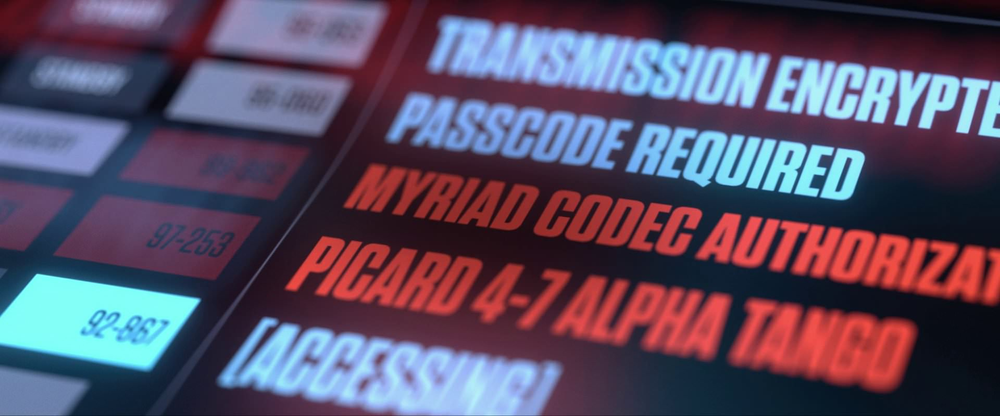

# `myriad`

Welcome to `myriad`. This is my glorious dumping ground of miscellaneous utilities, scripts, and guides that I've cobbled together over the years. Think of it as that drawer in your kitchen filled with random useful stuff that you can never find when you actually need it.

## Overview

`myriad` contains a hodgepodge of tools organized by language or technology — because some semblance of order is better than none:

- **Python**: Scripts for when I got tired of managing image metadata and organizing music by hand.
- **Shell**: Fish shell scripts for various system administration tasks.
- **TypeScript**: Code for when I wanted to feel modern but still stick with JavaScript.
- **Research**: A collection of notes that prove I spent work hours "investigating" things.
- **Images**: Visual assets, because sometimes words just don't convey my confusion properly.
- **Mixed**: Guides and configurations that refuse to fit neatly into a single category (just like my career).

## Repository Structure

### Python

#### `musicbrainz-picard`

Utilities for MusicBrainz Picard, because apparently I have opinions about how my music should be tagged. Very strong opinions.

#### `orphaned-xmp`

Tools for hunting down those pesky orphaned XMP metadata files that multiply like digital rabbits when you're not looking.

#### `xmp-mover`

Utilities for wrangling XMP sidecar files into submission. Photography workflows are fun, said no one ever who's had to manage thousands of these files.

### Shell

#### `asdf-latest.fish`

A Fish shell script for the [asdf version manager](https://asdf-vm.com/), because keeping track of language versions manually is a special kind of torture I reserve for my enemies.

#### `mastodon-maintenance.fish`

Maintenance scripts for Mastodon instances. Because running your own social media server wasn't complicated enough already.

#### `sixkcd.fish`

A Fish shell script for XKCD comics using Sixel graphics. Because sometimes you need a nerdy comic in your terminal as your `motd`.

### TypeScript

#### `bump`

A dependency manager that updates packages across multiple repositories and programming languages. Because manually updating dependencies is what we make junior developers do as punishment.

Features:

- Updates JavaScript, Python, and Ruby projects
- Smart version bumping based on semver rules
- Git integration that's probably smarter than my actual git workflow
- Terminal UI with spinners and colors, because watching plain text update is so 1970s

### Images

#### `multipurpose`

A collection of generic images I've needed more than once. The digital equivalent of those random cables you keep because "they might be useful someday."

#### `projects`

Project-specific images sorted by use case, including:

- **social**: Graphics for social media, carefully divided into JPEG and PNG formats because I apparently care deeply about file formats
- **square**: Square images for when circles just won't do

### Research

A graveyard of half-finished investigations and rabbit holes I fell into, including:

- **catppuccin**: Research on a color scheme that I spent way too much time perfecting
- **cloudflare**: Notes on cloud services that somehow always end up more complex than they should be
- **dependabot**: Documentation on automating updates that this repo probably needs
- **eve-online**: Research that definitely wasn't me playing games during work hours
- **gnu-find**: Advanced usage patterns for when `find . -name "*.txt"` just isn't complicated enough
- **javascript**: Notes on a language that I simultaneously love and hate
- **roadman-dialect**: Linguistics research that seemed important at the time
- **traffic-analysis**: Network investigation techniques that make me feel like I'm in a spy movie

### Mixed

#### `netflow`

Setting up network flow monitoring using `ntopng` with `netflow2ng` in Docker, using Mikrotik RouterOS 7. Includes:

- Docker environment setup (containers, containers everywhere!)
- Mikrotik RouterOS configuration (yes, the CLI is from 1995, and no, they won't change it)
- System maintenance
- Advanced configuration options
- Troubleshooting tips

## Usage

Each directory contains specific utilities with their own usage instructions. For detailed information about a particular tool, check the README in its directory. If it exists.

## Development

The repository uses several code quality tools because I like to pretend my haphazard collection of scripts is actually professional-grade software:

- [Ruff](https://github.com/charliermarsh/ruff) and [Black](https://github.com/psf/black) for Python linting
- [Biome](https://github.com/biomejs/biome) for TypeScript (and JavaScript if I *really* have to) linting
- [Sourcery](https://sourcery.ai/) for code quality suggestions (because having an AI tell me my code is bad is somehow less painful)
- The [Trunk](https://trunk.io/) metalinter

## License

[MIT](LICENSE).

## Contributing

This is primarily my personal junk drawer of tools, but if you feel compelled to contribute to this magnificent chaos, be my guest. Open an issue or submit a pull request.
